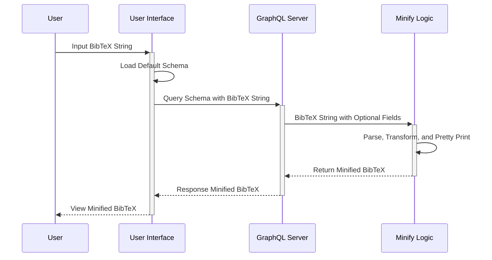

# Bibmin

```mermaid
sequenceDiagram
	participant US as User
	participant UI as User Interface
	participant GS as GraphQL Server
	participant ML as Minify Logic
	US ->>+ UI: Input BibTeX String
	UI ->> UI: Load Default Schema
	UI ->>+ GS: Query Schema with BibTeX String
	GS ->>+ ML: BibTeX String with Optional Fields
	ML ->> ML: Parse, Transform, and Pretty Print
	ML -->>- GS: Return Minified BibTeX
	GS -->>- UI: Response Minified BibTeX
	UI -->>- US: View Minified BibTeX


```

